# Intelligent SCADA System using GenAI 🏭🤖

## Overview

The objective of this project is to design an **Intelligent SCADA System** powered by **Generative AI**, transforming traditional SCADA from a passive monitoring tool into an active, AI-driven decision-support platform for industrial environments.

## The Project Involves

- **ASP.NET Core 8.0 (C#)**: Backend API orchestration, session memory management, and real-time SignalR streaming.
- **Python RAG Service (Flask)**: 7-stage RAG pipeline — intent classification, ChromaDB context retrieval, SQL generation, ML integration, and natural language response synthesis.
- **3-Stage ML Pipeline (TensorFlow / XGBoost / LightGBM)**: Hierarchical anomaly detection and predictive maintenance.
- **Generative AI (Mistral 7B / Groq llama-3.3-70b)**: Natural language understanding, SQL generation, and response narration.
- **ChromaDB**: Vector store populated with database schema and component knowledge for grounded RAG.
- **SignalR**: Real-time live data streaming to the dashboard.
- **iTextSharp & EPPlus**: Automated PDF and Excel report generation from within the chat interface.
- **Chart.js**: Inline data visualizations rendered dynamically in chat responses.

## Live Demo

**🔗 Deployed Application**: [Live Demo](https://swat-dashboard-hlxg.onrender.com/)
> **Note**: The deployed version uses **Groq (llama-3.3-70b-versatile)** as the LLM. The local version used **Mistral 7B Instruct v0.3 (4-bit quantized)** via Ollama, which delivered superior RAG and SQL generation performance due to tighter domain grounding and please be aware that the application may require a few minutes to cold-start upon your first visit.

## Screenshots

### Live Dashboard
<table>
  <tr>
    <td>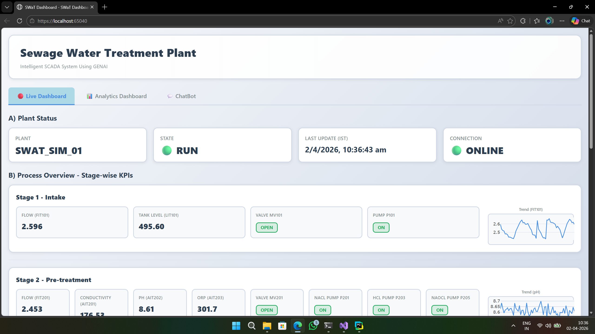</td>
    <td>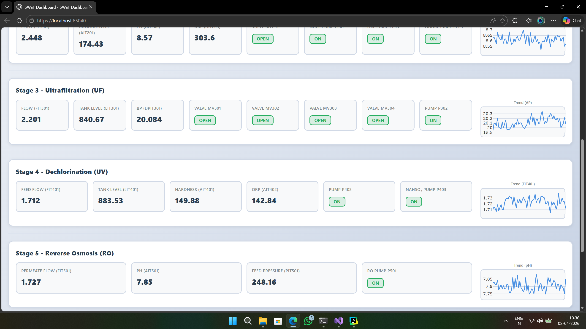</td>
  </tr>
</table>

### Predictive Maintenance
<table>
  <tr>
    <td>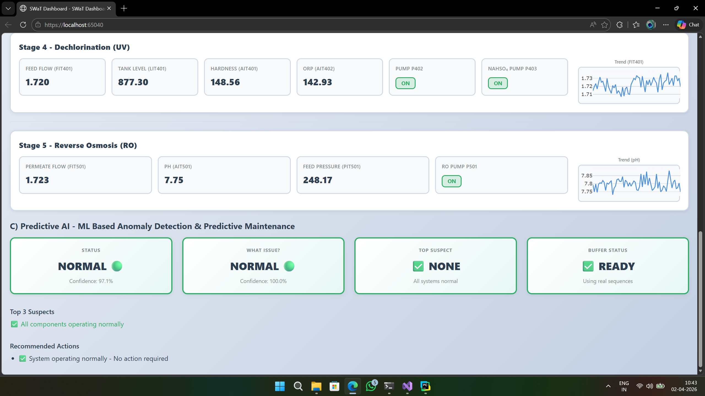</td>
    <td>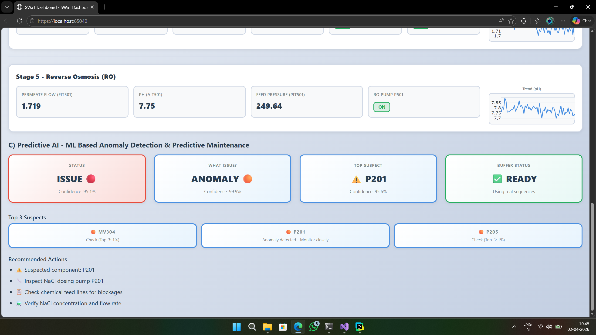</td>
  </tr>
  <tr>
    <td>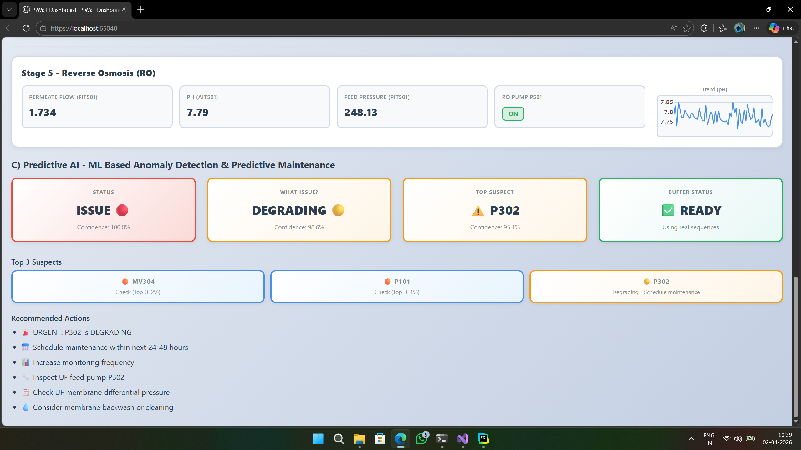</td>
    <td>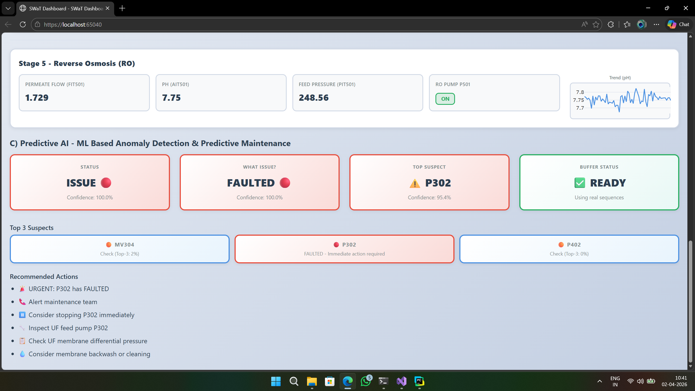</td>
  </tr>
</table>

### Analytics Dashboard
<table>
  <tr>
    <td>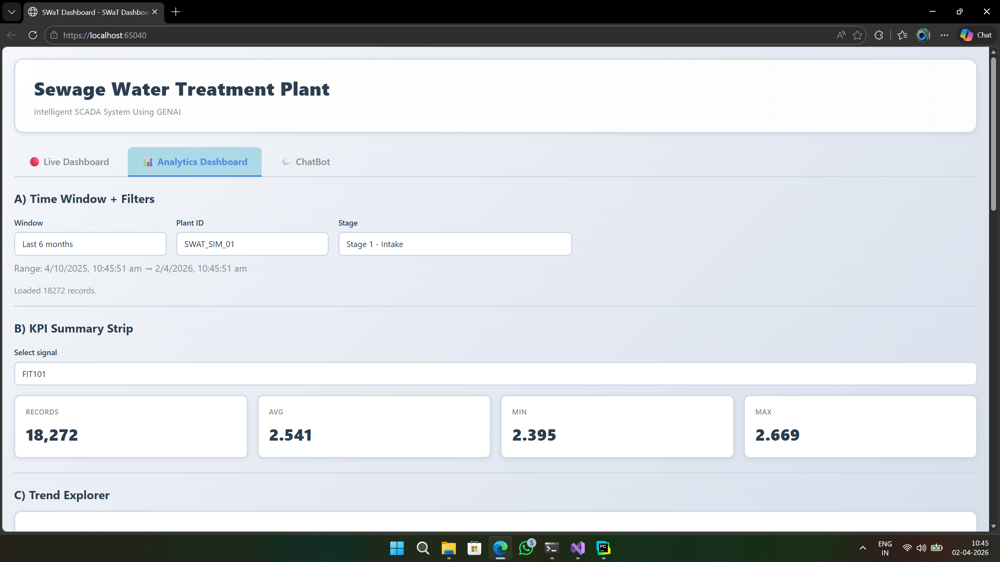</td>
    <td>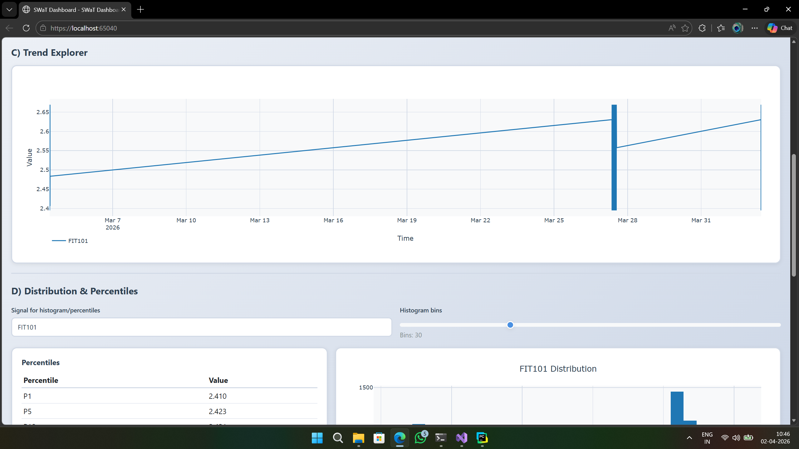</td>
  </tr>
  <tr>
    <td>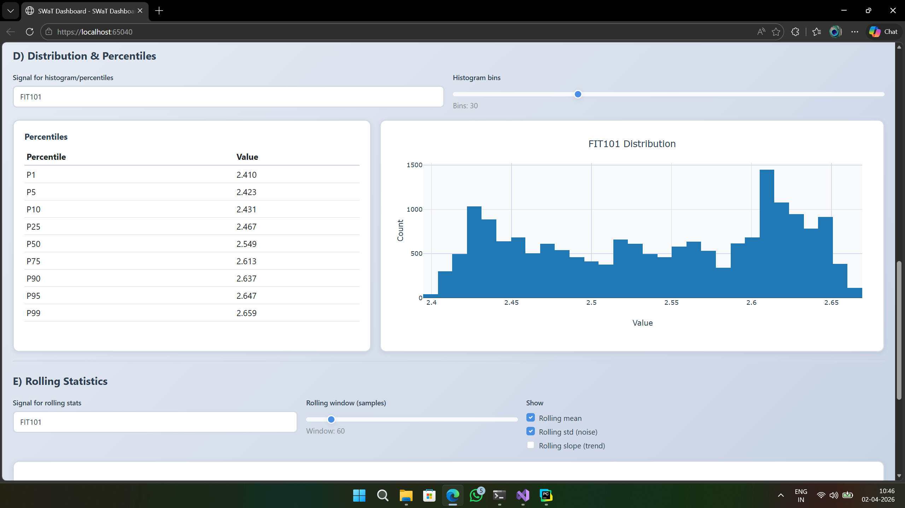</td>
    <td>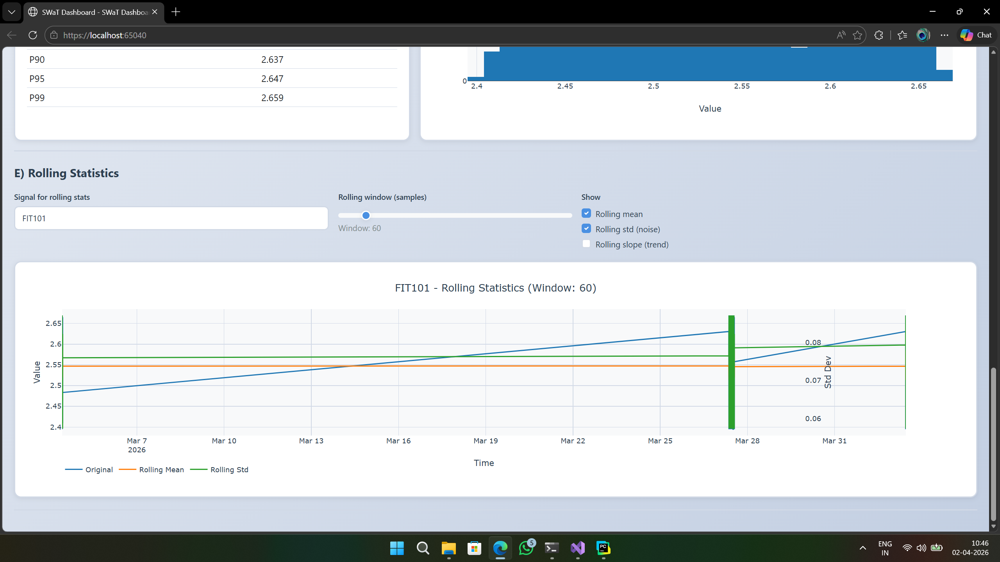</td>
  </tr>
</table>

### AI Chatbot
<table>
  <tr>
    <td>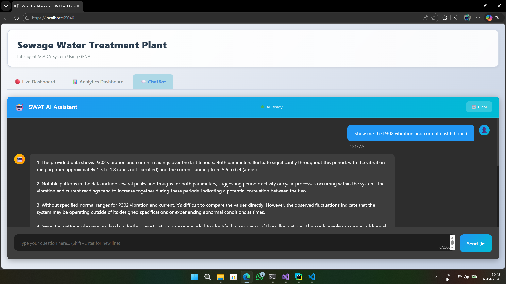</td>
    <td>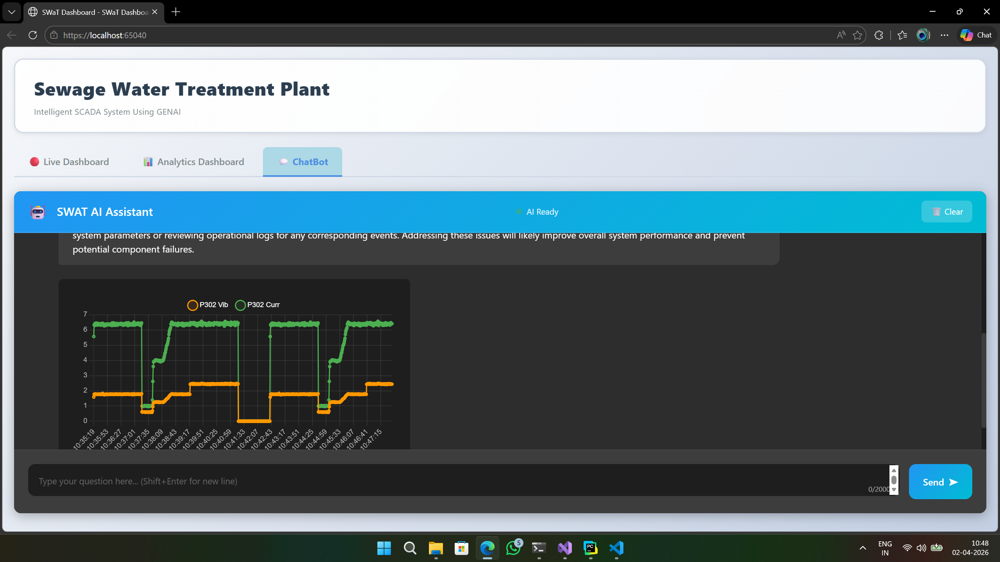</td>
  </tr>
  <tr>
    <td>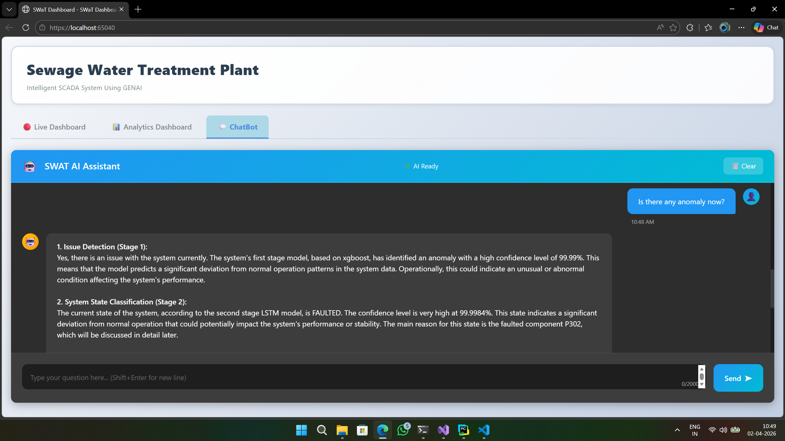</td>
    <td>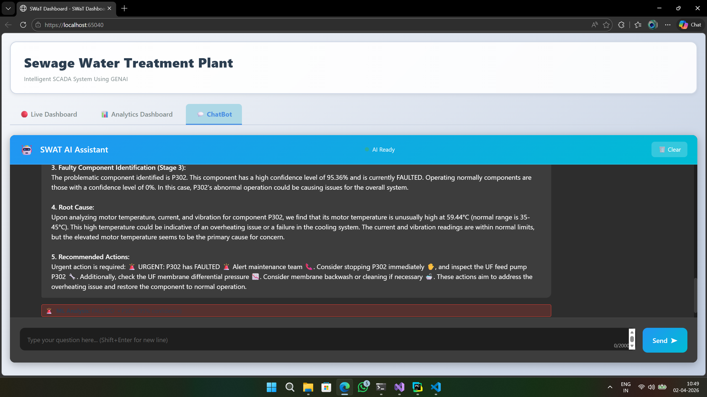</td>
  </tr>
</table>

---

## Overall Architecture

---

## ML Architecture

### The ML pipeline follows a hierarchical 3-stage classification approach:

###  ML Models & Justification of their selection 

| Stage | Models Trained | Selection Metric | Best Model | Test Performance |
|-------|---------------|-----------------|------------|-----------------|
| Stage 1 – Anomaly Detection | Autoencoder (U), Isolation Forest (U), XGBoost (S) | Recall | XGBoost | 87.4% |
| Stage 2 – Fault Classification | XGBoost (S), LSTM (S), 1D CNN (S) | F1-Macro | LSTM | 96.2% |
| Stage 3 – Component Identification | LightGBM (S), MLP (S), XGBoost (S) | Accuracy | XGBoost | 96.3% |

*(S) = Supervised | (U) = Unsupervised*

**Why different metrics per stage?**
- **Recall (Stage 1)**: Can't afford to miss anomalies — it's the first gate.
- **F1-Macro (Stage 2)**: Handles class imbalance across fault types.
- **Accuracy (Stage 3)**: Precise component identification for targeted maintenance.

---

## GenAI ChatBot Architecture

## RAG Pipeline

The conversational interface is powered by a 7-stage RAG pipeline:

| Stage | What Happens |
|-------|-------------|
| 1. Intent Understanding | LLM classifies the NL query — data query, ML prediction, or report request |
| 2. Context Retrieval | ChromaDB vector search retrieves relevant DB schema, component info, and conversation history |
| 3. SQL Generation | LLM generates safe, read-only SQL using retrieved context |
| 4. Data Execution | SQL runs against MS SQL Server; real-time data fetched via SignalR if needed |
| 5. ML Integration | If predictive query — calls 3-stage ML pipeline for health predictions |
| 6. Report Integration | If report request — generates PDF/Excel with actual plant data |
| 7. Response Generation | LLM explains results in natural language + generates Chart.js config for visualizations |

> RAG = Retrieval-Augmented Generation — grounds LLM responses to actual plant data, eliminating hallucination of schema and column names.

---

## Alert System

Confidence-based escalation with smart cooldown and state persistence filtering:

| State | Confidence | 📧 Email | 📱 SMS | 📞 Call |
|-------|-----------|---------|--------|--------|
| NORMAL | — | ❌ | ❌ | ❌ |
| DEGRADING | Any | ✅ | ❌ | ❌ |
| FAULTED | < 90% | ✅ | ✅ | ❌ |
| FAULTED | > 90% | ✅ | ✅ | ✅ |

Each alert includes the affected component, top 3 suspected causes, confidence level, timestamp, and recommended corrective actions.

---

## Key Innovations

- **Conversational SCADA Interface** — Ask the system anything in plain English; it queries the database, runs ML inference, and narrates the results.
- **From Reactive → Proactive** — Predictive maintenance embedded directly in the SCADA loop.
- **GenAI Anomaly Narration** — Not just fault detection; the system describes the probable cause and suggests corrective action.
- **Inline Visualizations** — Chart.js charts generated dynamically within chat responses based on query context.
- **ASP.NET Core MVC** — Eliminated full-page refreshes, reduced latency via SignalR, and improved UX significantly.

---

## License

This project is licensed under the MIT License - see the [LICENSE](LICENSE) file for details.

## Contact

For any queries or contributions, feel free to reach out to:

- **Ariharasudhan A** – [Email](mailto:ariadaikalam1234@gmail.com)
- **Harish R** – [Email](mailto:harishsekar2004@gmail.com)
